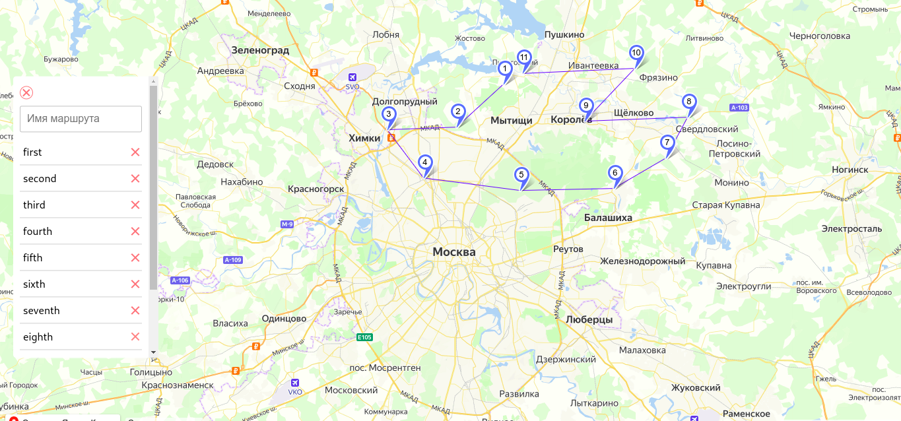

# Одностраничное приложение [Редактор маршрутов](https://yandex-maps-47de7.web.app).

;

## Возможности проекта

- Добавление и удаление точек маршрута;
- Изменение порядка маршрутов в списке;
- Изменение координат метки путём перетаскивания;
- Создание собственного маршрута.

## Используемые инструменты

- [React](https://reactjs.org/)
- [Redux](https://redux.js.org/)
- [TypeScript](https://www.typescriptlang.org/)
- [React Testing Library](https://testing-library.com/docs/)
- [Jest](https://jestjs.io/)
- [SCSS](https://sass-lang.com/)

## Запуск тестов

- `npm test`

## Запуск приложения

- `npm start` - Запускает приложение на локальном сервере [localhost:3000](http://localhost:3000).
- `npm run build` - Запускает сборку приложения.
